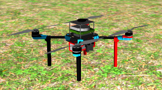

# The Old Gazebo Simulation

> :warning: **Attention please: This package is no longer maintained!!!**
>
> This is an old package that is no longer maintained.
> The new version of the Gazebo Simulation is located [here](https://github.com/ctu-mrs/mrs_uav_gazebo_simulation).
> This repository will be erased soon

## Submodules

| ROS Package                                                                           |
|---------------------------------------------------------------------------------------|
| [mrs_simulation](https://github.com/ctu-mrs/mrs_simulation)                           |
| [mrs_gazebo_common_resources](https://github.com/ctu-mrs/mrs_gazebo_common_resources) |
| [px4](https://github.com/ctu-mrs/px4_firmware)                                        |
| [mavlink_sitl_gazebo](https://github.com/ctu-mrs/px4_sitl_gazebo)                     |

## System requirements

Required OS is Ubuntu 20.04 LTS 64-bit or its flavors that can install ROS Noetic.
The suggested variant of OS installation is dual boot instead of virtualization that can be slow and can not handle well the simulation GUI.
We use [Gitman](https://github.com/jacebrowning/gitman) to manage the repository **submodules**.
The repository are supposed to be compiled by [catkin tools](https://catkin-tools.readthedocs.io).

## Unmanned Aerial Vehicles

| Model        | Spawn argument | Simulation                    |
|--------------|----------------|-------------------------------|
| DJI f330     | `--f330`       |  |
| DJI f450     | `--f450`       |  |
| Holybro x500 | `--x500`       |  |
| DJI f550     | `--f550`       |  |
| Tarot t650   | `--t650`       |  |
| NAKI II      | `--naki`       |  |

## Examples of tmuxinator simulation sessions

Selected tmuxinator scripts:

- [example_tmux_scripts/one_drone_gps](example_tmux_scripts/one_drone_gps)
- [example_tmux_scripts/one_drone_gps_standalone](example_tmux_scripts/one_drone_gps_standalone)
- [example_tmux_scripts/one_drone_optic_flow](example_tmux_scripts/one_drone_optic_flow)
- [example_tmux_scripts/two_drones_gps](example_tmux_scripts/two_drones_gps)

Bare tmux script (similar to the one used on real UAVs):

- [example_tmux_scripts/just_flying_bare_tmux](example_tmux_scripts/just_flying_bare_tmux)

For detail description of script capabilities for spawning vehicles see [mrs_simulation](https://github.com/ctu-mrs/mrs_simulation).

## Finishing your .bashrc

The `install.sh` script will add the following to your .bashrc:
```bash
source /opt/ros/<ros_version>/setup.bash
source /usr/share/gazebo/setup.sh
```
